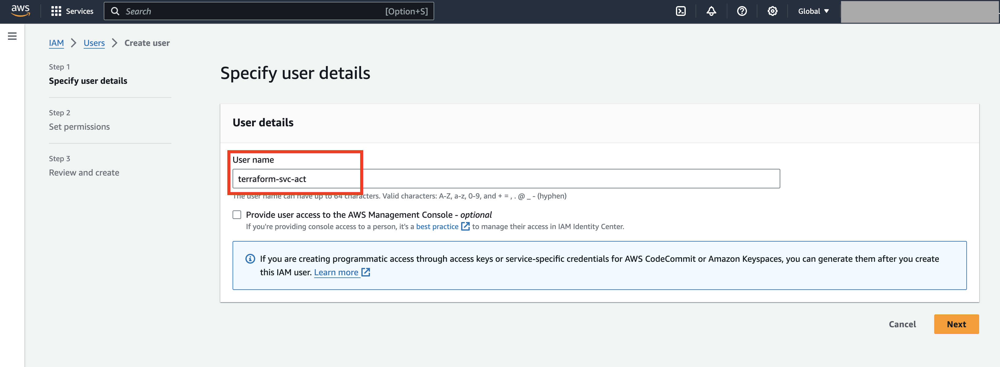
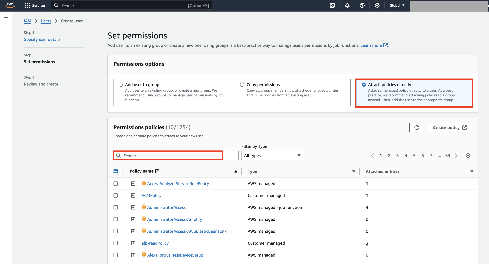
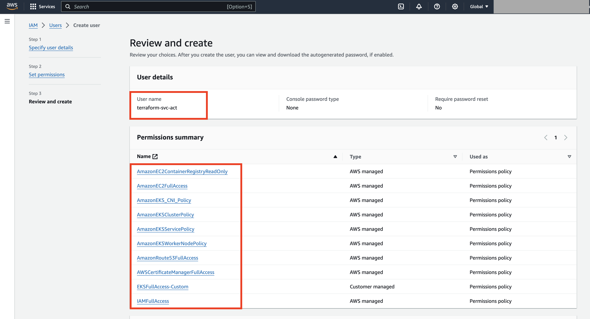
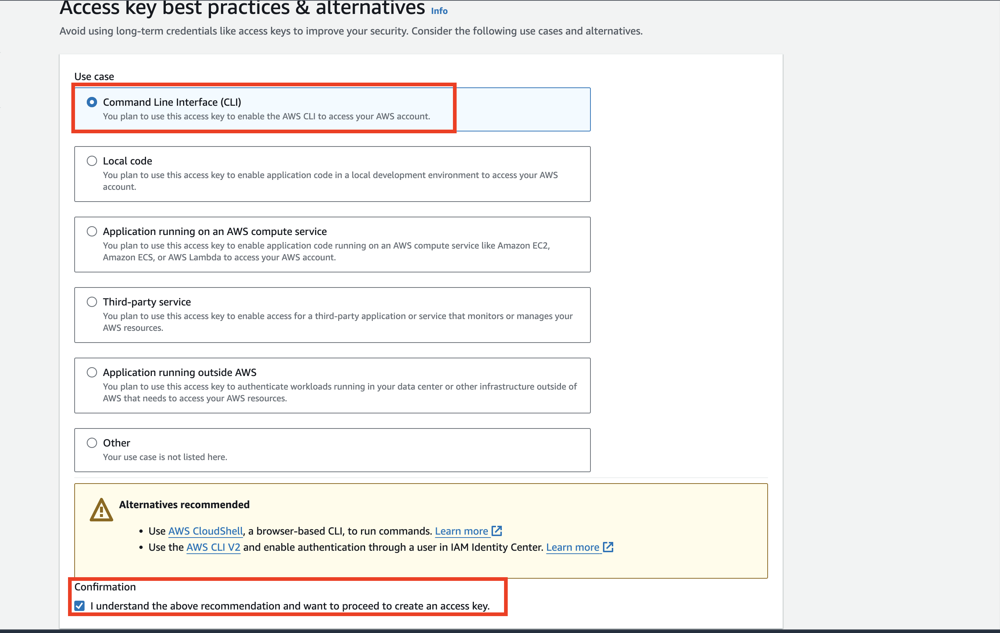

# 3Edges Cloud Installation

This repository contains Terraform scripts to deploy the 3Edges software across cloud provider. These scripts automate the infrastructure setup, ensuring a seamless deployment process of 3Edges into your cloud environment. 

## Features
- Automated Cloud Infrastructure: Deploys and configures cloud resources for 3Edges, such as VPCs, load balancers, Kubernetes clusters, databases, and more. 

- Scalable and Secure: Includes cloud-native best practices for security, scalability, and reliability.

- Easy Configuration: Customize settings like region, cluster names, and database credentials through a simple configuration file (terraform.tfvars).

## Customization
You can modify various settings, just to name a few:
- Cluster names
- Database configurations
- Networking settings
- Admin emails and passwords

These can be set in the ```terraform.tfvars file```


## Prerequisites
- Terraform

- AWS CLI (For AWS deployment)

- Access to your preferred cloud provider (Currently we support deployment to AWS, we are working on support to other cloud providers)

- IAM permissions for provisioning resources on your cloud platform


# On AWS

## Create an IAM User for Terraform

In the AWS Management Console, navigate to **IAM** \> **Users** \> **Add User.**  




Attach the following AWS managed policies to the user  
    
  - AmazonEC2ContainerRegistryReadOnly
  
  - AmazonEC2FullAccess
  
  - AmazonEKS\_CNI\_Policy  
  
  - AmazonEKSClusterPolicy  
  
  - AmazonEKSServicePolicy  
  
  - AmazonEKSWorkerNodePolicy  
  
  - AmazonRoute53FullAccess  
  
  - AWSCertificateManagerFullAccess  
  
  - IAMFullAccess 



Create a custom policy that allows full access to EKS, and attach it to the user

**EKSFullAccess-Custom**

```
{
    "Version": "2012-10-17",
    "Statement": [
        {
            "Effect": "Allow",
            "Action": [
                "eks:*"
            ],
            "Resource": "*"
        }
    ]
}
```


You should have a total of **10 Permission policy** attached 



## Create Access Keys for the IAM User

Once the IAM user is created, generate an **Access Key**


Make sure to download and protect the access key for later use.



# 

# On Terraform Host

Make sure you have installed terraform, aws cli and git client on your terraform host.

## Configure AWS CLI

Use the access key and secret key generated in the previous step to configure the AWS CLI

```
# aws configure  
```


## Clone the GitHub Repository

Clone the repository containing the Terraform configuration:

```
# git clone https://github.com/3Edges/3edges-deployments.git
```

 

## Modify the Terraform Configuration

Update the `terraform.tfvars` file with your environment details

```
3edges-deployments/terraform/aws/terraform.tfvars
```

## Deploy 3Edges to AWS

After making the necessary changes, run the deployment script

```
# cd 3edges-deployments/terraform/aws/
# ./run.sh
```
