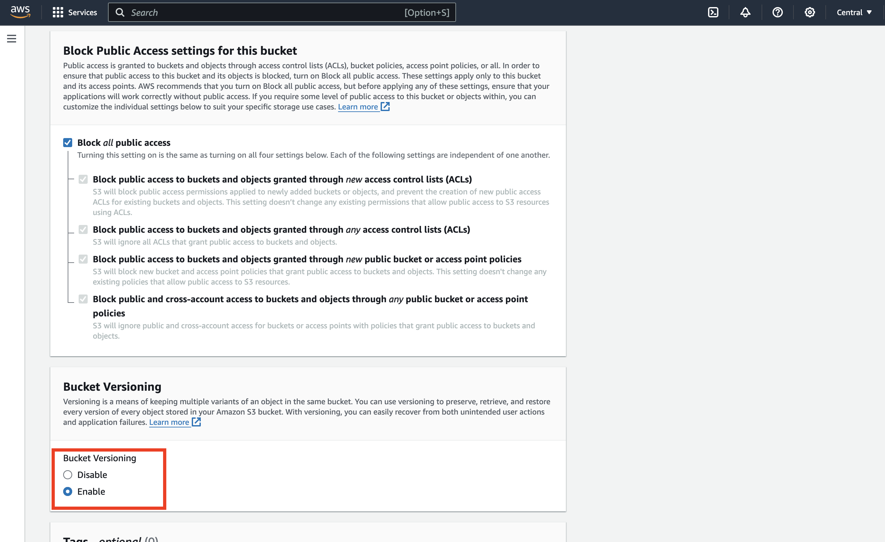
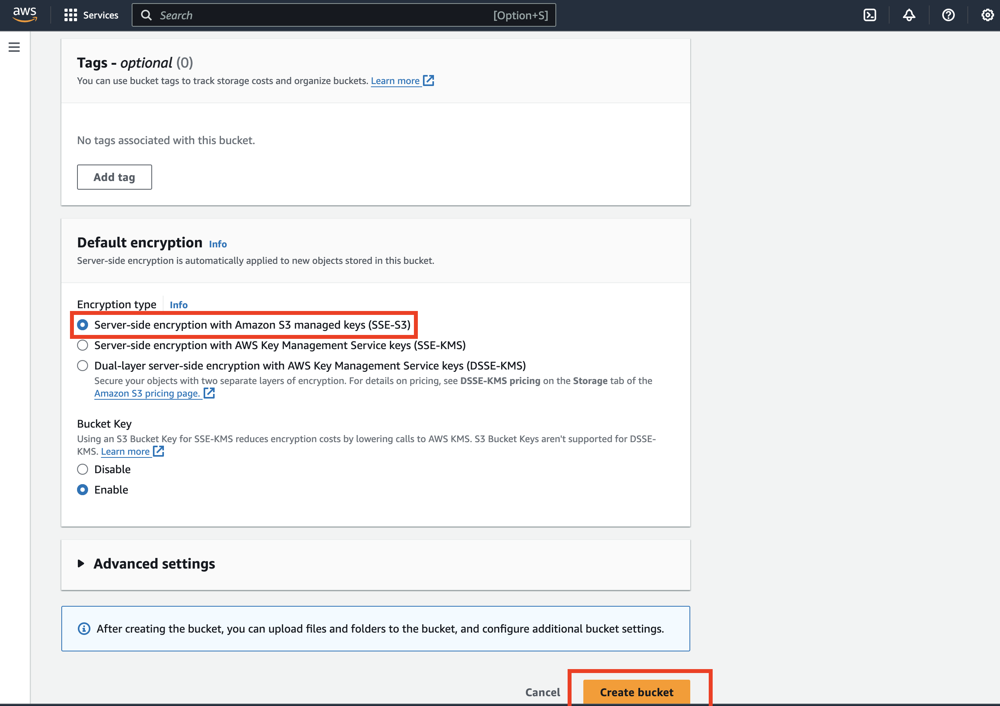
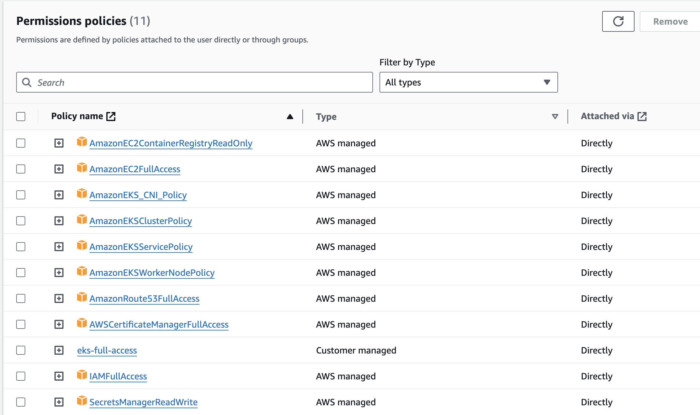
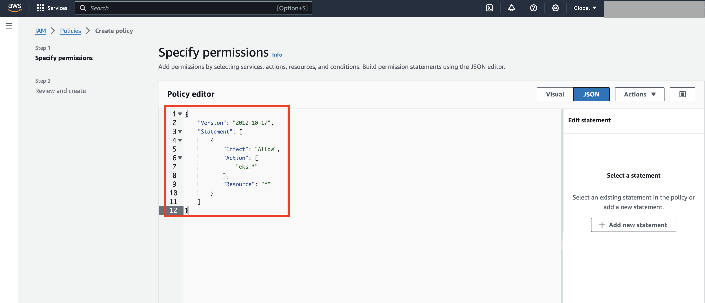
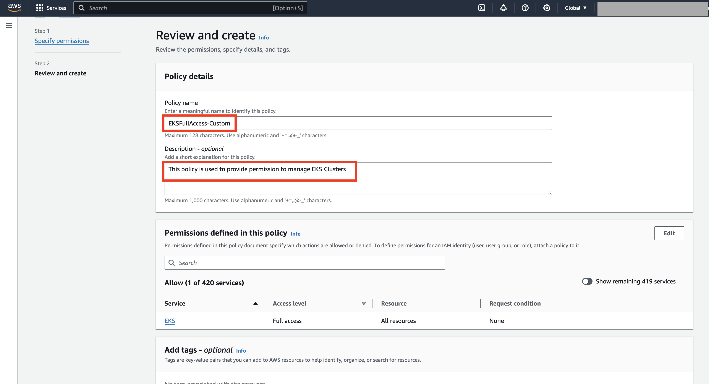
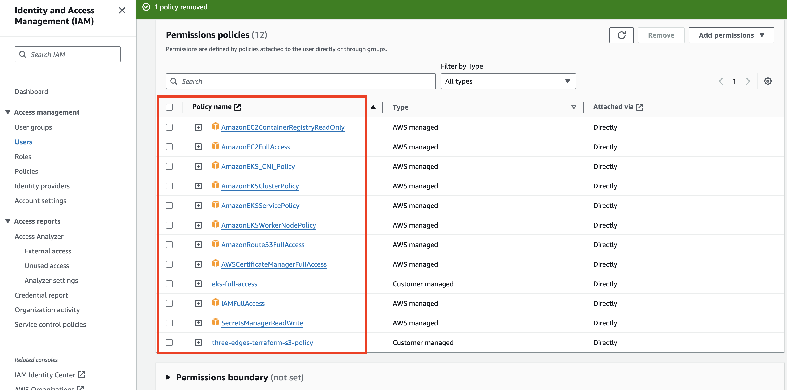
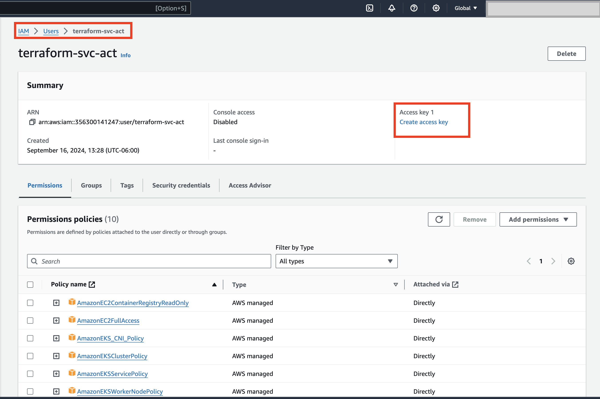
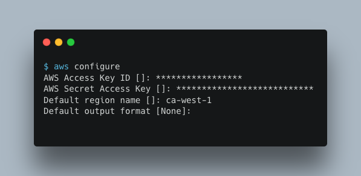

# AWS Deployment

## Prerequisites
- Terraform

- AWS CLI (For AWS deployment)

- Git

- Docker 

- Neo4j

- Domain name and access to domain controller


# On AWS

## Create an S3 Bucket for Terraform to store the statefile 






## Create an IAM User for Terraform

In the AWS Management Console, navigate to **IAM** \> **Users** \> **Add User.**  


Attach the following AWS managed policies to the user  
    
  - AmazonEC2ContainerRegistryReadOnly
  
  - AmazonEC2FullAccess
  
  - AmazonEKS\_CNI\_Policy  
  
  - AmazonEKSClusterPolicy  
  
  - AmazonEKSServicePolicy  
  
  - AmazonEKSWorkerNodePolicy  
  
  - AmazonRoute53FullAccess  
  
  - AWSCertificateManagerFullAccess  
  
  - IAMFullAccess

  - SecretsManagerReadWrite 



Create a custom policy that allows full access to EKS, and attach it to the user

**EKSFullAccess-Custom**

```
{
    "Version": "2012-10-17",
    "Statement": [
        {
            "Effect": "Allow",
            "Action": [
                "eks:*"
            ],
            "Resource": "*"
        }
    ]
}
```





Create a custom policy that allows access to S3 bucket to store terraform state file, and attach it to the user

**three-edges-terraform-s3-policy**

```
{
    "Version": "2012-10-17",
    "Statement": [
        {
            "Effect": "Allow",
            "Action": [
                "s3:PutObject",
                "s3:GetObject",
                "s3:ListBucket"
            ],
            "Resource": [
                "arn:aws:s3:::REPLACE-WITH-YOUR-S3-BUCKET-NAME",
                "arn:aws:s3:::REPLACE-WITH-YOUR-S3-BUCKET-NAME/*"
            ]
        }
    ]
}
```


You should have a total of **12 Permission policy** attached 



## Create Access Keys for the IAM User

Once the IAM user is created, generate an **Access Key**



Make sure to download and protect the access key for later use.


# 

# On Terraform Host

Make sure you have installed terraform, aws cli and git and docker on your terraform host.

## Configure AWS CLI

Use the access key and secret key generated in the previous step to configure the AWS CLI

```
# aws configure  
```



## Clone the GitHub Repository

Clone the repository containing the Terraform configuration:

```
# git clone https://github.com/3Edges/3edges-deployments.git
```

## Modify the Backend Configuration 

Update the `backend.tf` file with your S3 bucket details

```
3edges-deployments/terraform/aws/backend.tf
```

## Modify the Terraform Configuration

Update the `terraform.tfvars` file with your environment details

```
3edges-deployments/terraform/aws/terraform.tfvars
```

## Deploy 3Edges to AWS

After making the necessary changes, run the deployment script

```
# cd 3edges-deployments/terraform/aws/
# ./run.sh
```

## Configuring Domain with Route 53 Name Servers

1. In AWS Route 53, go to your hosted zone and copy the 4 name servers listed in the NS record.

2. Go to your domain registrar's dashboard and replace the existing name servers with the ones from Route 53.