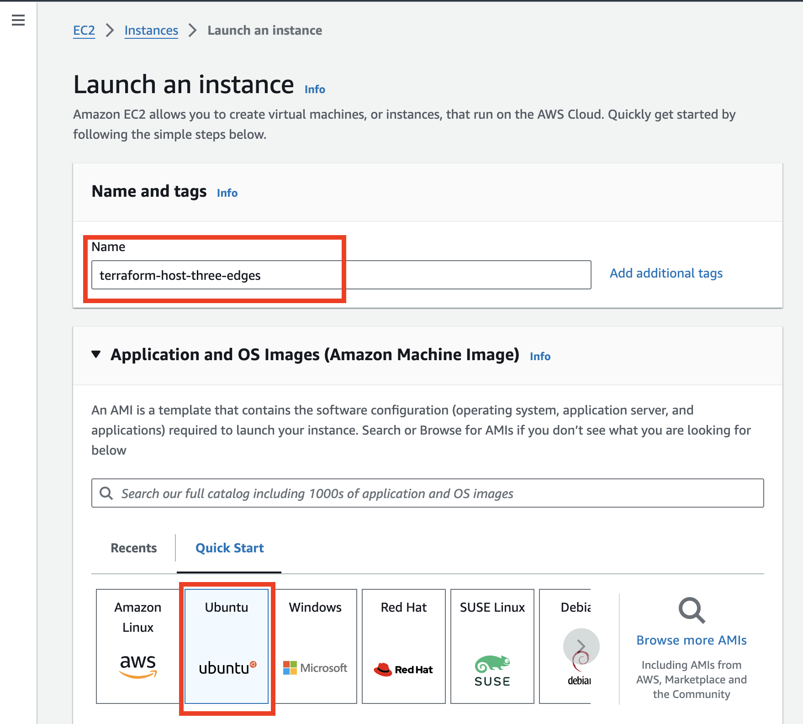
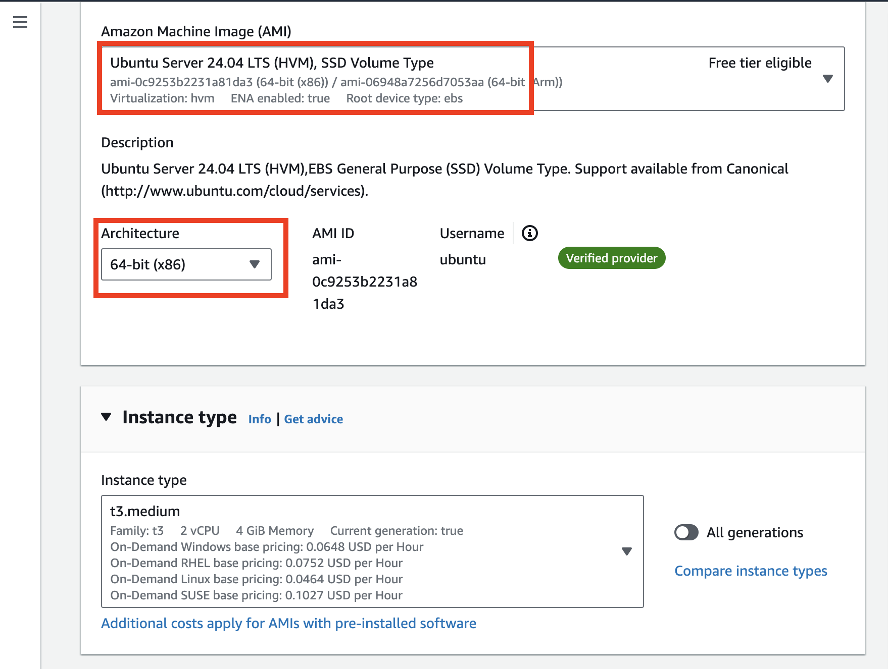
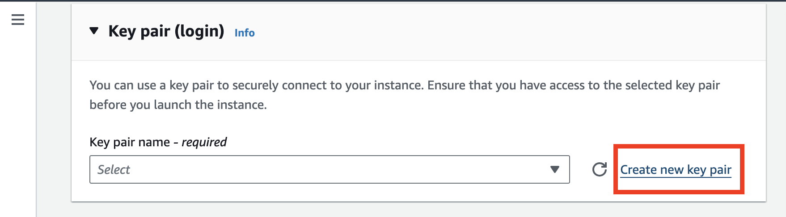
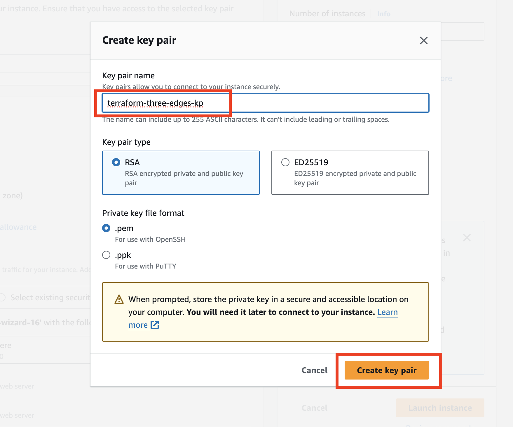
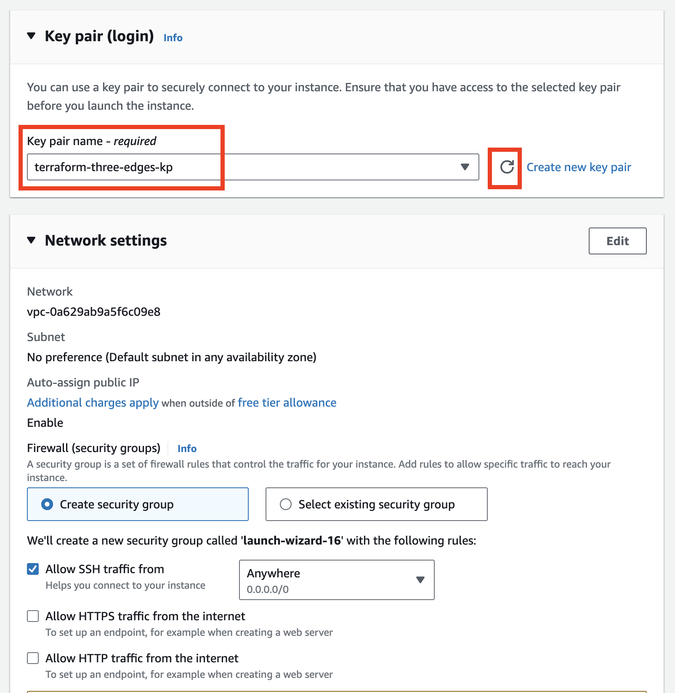
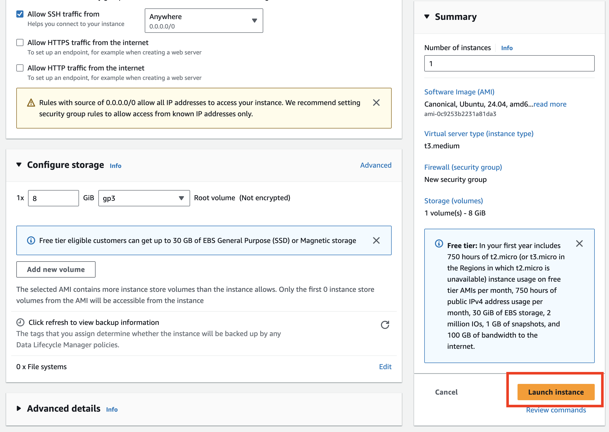
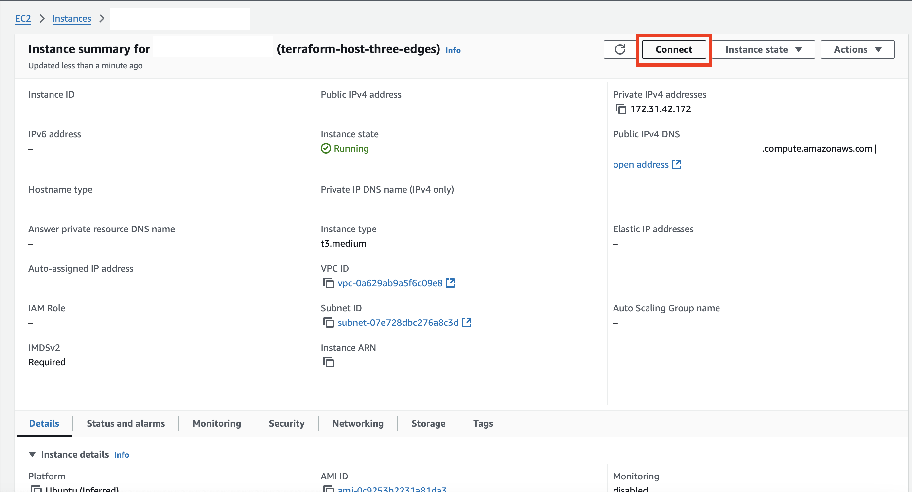
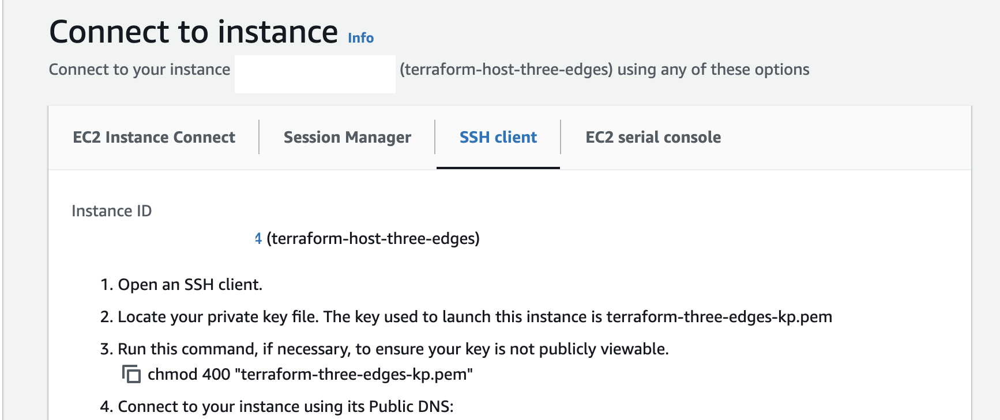
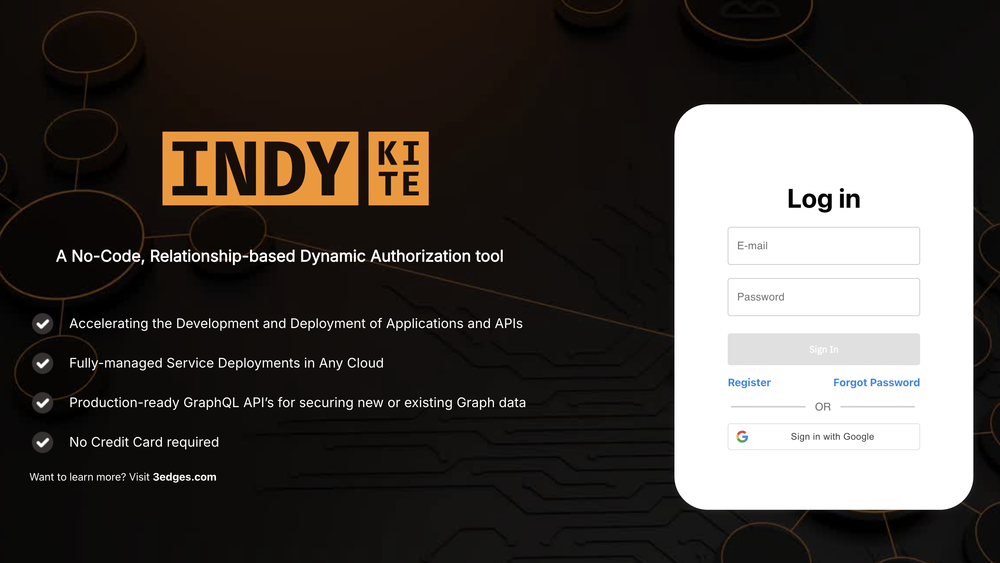

# AWS Deployment

## Table of Contents
1. [Prerequisites](#prerequisites)
2. [Configuring Domain with Route 53 Name Servers](#configuring-domain-with-route-53-name-servers)
3. [On AWS](#on-aws)
   - [EC2 Instance Creation (Terraform Host)](#ec2-instance-creation-terraform-host)
   - [Install Prerequisites on EC2 Instance](#install-prerequisites-on-ec2-instance)
   - [Create an S3 Bucket for Terraform Statefile](#create-an-s3-bucket-for-terraform-to-store-the-statefile)
   - [Create an IAM User for Terraform](#create-an-iam-user-for-terraform)
   - [Attach Policies to IAM User](#attach-policies-to-iam-user)
   - [Create Access Keys for IAM User](#create-access-keys-for-the-iam-user)
4. [On Terraform Host (EC2 instance)](#on-terraform-host-ec2-instance)
   - [Configure AWS CLI](#configure-aws-cli)
   - [Clone the GitHub Repository](#clone-the-github-repository)
   - [Modify the Backend Configuration](#modify-the-backend-configuration)
   - [Modify the Terraform Configuration](#modify-the-terraform-configuration)
5. [Deploy 3Edges to AWS](#deploy-3edges-to-aws)
6. [Decommission the 3Edges deployment](#decommission-the-3edges-deployment)
7. [Release Notes - Post Release Actions](#release-notes---post-release-actions)

## Prerequisites
- Terraform

- AWS CLI (For AWS deployment)

- Docker 

- kubectl

- Git

- Neo4j Database access

- Domain name and access to domain controller

## Configuring Domain with Route 53 Name Servers

If you are deploying 3Edges on a **Root domain** 

1. In AWS Route 53, go to your hosted zone and copy the 4 name servers listed in the NS record.

2. Go to your domain registrar's dashboard and replace the existing name servers with the ones from Route 53.


If you are deploying 3Edges on a **sub-domain**

1. Make sure you have Route53 record for your root domain and Route53 Nameservers added to your Domain Controller's Nameservers section.


# On AWS

## EC2 Instance creation (Terraform Host)

This EC2 instance is from where terraform provisions the infrastructure on AWS for 3Edges deployment. 













Once the EC2 instance state turns "Running" you can "Connect" to EC2 instance





After you are connected to EC2 Instance, install the pre-requisites on EC2 instance
---
Terraform installation on EC2. Follow the official documentation

[Terraform Installation Link](https://developer.hashicorp.com/terraform/tutorials/aws-get-started/install-cli#install-terraform)

```
sudo apt-get update && sudo apt-get install -y gnupg software-properties-common

wget -O- https://apt.releases.hashicorp.com/gpg | \
gpg --dearmor | \
sudo tee /usr/share/keyrings/hashicorp-archive-keyring.gpg > /dev/null

gpg --no-default-keyring \
--keyring /usr/share/keyrings/hashicorp-archive-keyring.gpg \
--fingerprint

echo "deb [signed-by=/usr/share/keyrings/hashicorp-archive-keyring.gpg] \
https://apt.releases.hashicorp.com $(lsb_release -cs) main" | \
sudo tee /etc/apt/sources.list.d/hashicorp.list
```
```
sudo apt update

sudo apt-get install terraform

terraform -help

```
---
[AWS Cli Installation Link](https://docs.aws.amazon.com/cli/latest/userguide/getting-started-install.html#getting-started-install-instructions)

```
snap version

sudo snap install aws-cli --classic

aws help
```
---
[Docker Installation Link](https://docs.docker.com/engine/install/ubuntu/#install-using-the-repository)

```
# Add Docker's official GPG key:
sudo apt-get update
sudo apt-get install ca-certificates curl
sudo install -m 0755 -d /etc/apt/keyrings
sudo curl -fsSL https://download.docker.com/linux/ubuntu/gpg -o /etc/apt/keyrings/docker.asc
sudo chmod a+r /etc/apt/keyrings/docker.asc

# Add the repository to Apt sources:
echo \
  "deb [arch=$(dpkg --print-architecture) signed-by=/etc/apt/keyrings/docker.asc] https://download.docker.com/linux/ubuntu \
  $(. /etc/os-release && echo "$VERSION_CODENAME") stable" | \
  sudo tee /etc/apt/sources.list.d/docker.list > /dev/null
sudo apt-get update
```
```
sudo apt-get install docker-ce docker-ce-cli containerd.io docker-buildx-plugin docker-compose-plugin
```
```
sudo usermod -aG docker $USER
```
**Make sure to log out and log back in or restart your terminal session for the changes to take effect**

---
[kubectl Installation Link](https://kubernetes.io/docs/tasks/tools/install-kubectl-linux/#install-using-other-package-management)

```
snap install kubectl --classic
kubectl version --client
```

---
Git installation : Usually Ubuntu EC2 instance comes with git installed in the OS. In-case if its not installed run the following command  
```
sudo apt-get install git

git help
```

## Create an S3 Bucket for Terraform to store the statefile 

NOTE: ca-west-1 (Calgary) region is not supported as S3 Bucket Backend. Try to use ca-central-1 (Canada Central)


## Create an IAM User for Terraform

In the AWS Management Console, navigate to **IAM** \> **Users** \> **Add User.**  


---
Create a custom policy that allows full access to EKS, and attach it to the user

**EKSFullAccess**

```
{
    "Version": "2012-10-17",
    "Statement": [
        {
            "Effect": "Allow",
            "Action": [
                "eks:*"
            ],
            "Resource": "*"
        }
    ]
}
```


---
Create another custom policy that allows access to S3 bucket to store terraform state file, and attach it to the user

**three-edges-terraform-s3-policy**

```
{
    "Version": "2012-10-17",
    "Statement": [
        {
            "Effect": "Allow",
            "Action": [
                "s3:PutObject",
                "s3:GetObject",
                "s3:ListBucket"
            ],
            "Resource": [
                "arn:aws:s3:::REPLACE-WITH-YOUR-S3-BUCKET-NAME",
                "arn:aws:s3:::REPLACE-WITH-YOUR-S3-BUCKET-NAME/*"
            ]
        }
    ]
}
```


Attach the following AWS managed policies to the user  
    
  - AmazonEC2ContainerRegistryReadOnly
  
  - AmazonEC2FullAccess
  
  - AmazonEKS\_CNI\_Policy  
  
  - AmazonEKSClusterPolicy  
  
  - AmazonEKSServicePolicy  
  
  - AmazonEKSWorkerNodePolicy  
  
  - AmazonRoute53FullAccess  
  
  - AWSCertificateManagerFullAccess  
  
  - IAMFullAccess

  - SecretsManagerReadWrite 

  - EKSFullAccess (Customer Managed)

  - three-edges-terraform-s3-policy (Customer Managed)

You should have a total of **12 Permission policies** attached 


## Create Access Keys for the IAM User

Once the IAM user is created, generate an **Access Key**


Make sure to download and protect the access key for later use.


# On Terraform Host (EC2 instance)

Make sure you have installed terraform, aws cli and git and docker on your terraform host (EC2 Instance).

## Configure AWS CLI

Use the access key and secret key generated in the previous step to configure the AWS CLI

```
# aws configure  
```


## Clone the GitHub Repository

Clone the repository containing the Terraform configuration:

```
# git clone https://github.com/3Edges/3edges-deployments.git
```

## Modify the Backend Configuration 

Rename backend.tf.sample to backend.tf. Update the `backend.tf` file with your S3 bucket details

```
cp /path/to/3edges-deployments/terraform/aws/backend.tf.sample /path/to/3edges-deployments/terraform/aws/backend.tf 
```

## Modify the Terraform Configuration

Rename terraform.tfvars.sample to terraform.tfvars. Update the `terraform.tfvars` file with your environment details

```
cp /path/to/3edges-deployments/terraform/aws/terraform.tfvars.sample /path/to/3edges-deployments/terraform/aws/terraform.tfvars
```

## Deploy 3Edges to AWS

After making the necessary changes, run the deployment script

```
# cd 3edges-deployments/terraform/aws/
# ./run.sh
```

Once the DNS propagation is successful, open your configured domain in the browser, you will a see Login Page



## Decommission the 3Edges deployment

Warning: Running terraform destroy is a destructive operation that will permanently delete all resources created by your Terraform configuration. Use this command with caution, and ensure you have backups or snapshots of any critical data before proceeding.

#### Destroy Terraform-managed Resources

Run the following command to remove all resources defined in the Terraform state. Double-check that you are in the correct environment before executing this command.

```bash
    cd /path/to/3edges-deployments/terraform/aws
    
    terraform destroy
```

When prompted, confirm the destruction process by typing "yes."

## Release Notes - Post Release Actions

After a new release of 3Edges, follow these steps to update your deployment. This ensures that any updates to configuration, secrets, or deployments are applied to your environment.

1. **SSH to EC2 Instance**  
   - Access the EC2 instance that is running as the Terraform host by connecting via SSH.

2. **Navigate to the Repository**  
   - Once connected, navigate to the directory where the Git repository is located (e.g., `/home/ubuntu/3edges-deployments/`).
   ```bash
   cd /path/to/3edges-deployments/
   ```
3. **Pull the latest changes**
    - Fetch the most recent updates from the Git repository to ensure you have the latest code, configurations, and scripts
    ```bash
      git pull origin main
    ```
4. Run the Terraform Bash Script
   - Execute the Terraform script to apply any infrastructure updates required for the release.
   ```bash
   cd /path/to/3edges-deployments/terraform/aws
   ./run.sh
   ```

5. **Authenticate to EKS Cluster**
   - Set up the connection to the EKS cluster using the AWS CLI to manage Kubernetes resources.
   ```bash
   aws eks update-kubeconfig --region <your-region> --name <cluster-name>
   ```

6. Update ConfigMaps, Secrets, and Restart Deployments
   - Use ```kubectl``` commands to update ConfigMaps and Secrets with the latest values, and restart any deployments that have been updated.
   ```bash
    kubectl rollout restart deployment/<deployment-name> -n 3edges
   ```

7. Monitor the deployment to ensure that all pods are successfully running, confirming a stable and operational environment.
    ```bash
     kubectl get all -n 3edges
    ```

